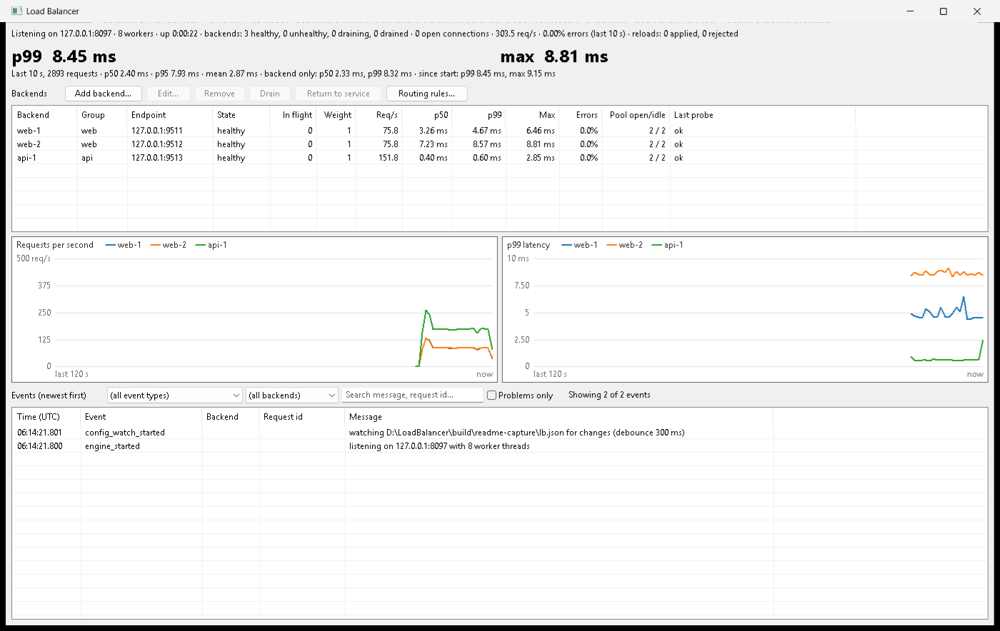
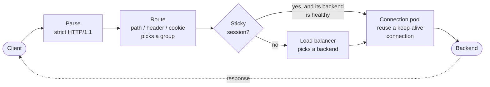
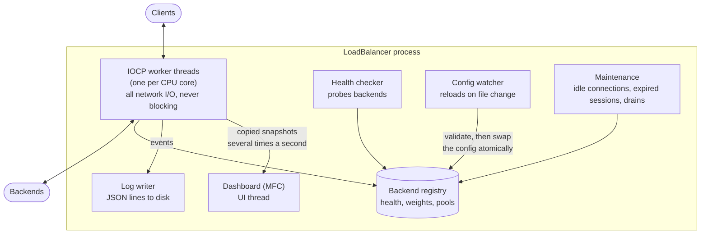
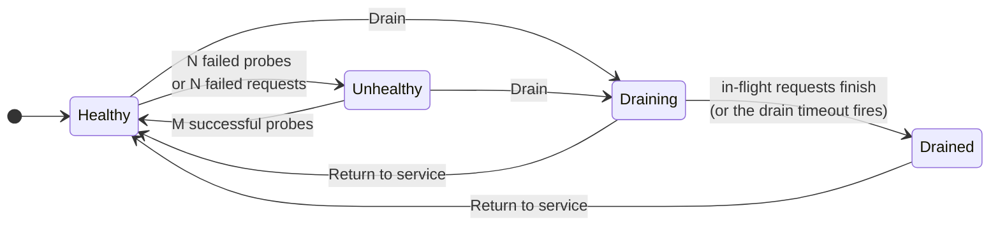

# LoadBalancer

An HTTP/1.1 reverse proxy and load balancer for Windows, written in C++20. The networking core is
built on Winsock I/O completion ports (IOCP), and an MFC desktop dashboard lets you watch and
manage it live.



*The dashboard under load: three backends (web-2 is slower), live traffic and p99 graphs, the
event log and admin buttons.*

## What it can do

All numbers are real measurements, taken on **one laptop** that ran the load generator, the proxy
and the backends at the same time (Intel i5-1135G7, 4 cores / 8 threads, 8 GB RAM). Details and raw
results are in [docs/benchmarks.md](docs/benchmarks.md).

| | |
|---|---|
| 🚀 **Throughput** | **5,000 requests/second** sustained with **0.245 ms p99** inside the proxy. That was the most the load generator could send on this laptop; the proxy wasn't the limit. |
| ⚡ **Overhead** | About **16 µs** added per request (p50), **48 µs** at p99 |
| 🏃 **Endurance** | **1.89 million requests in 30 minutes, 0 failed.** Handle count 223 → 223, memory +0.13 MB: no leaks. |
| 💥 **Failover** | A killed backend is out of rotation in **1.5 s**, with **0 errors** after that. Restarted, it's back in **0.7 s**. |
| 🔧 **Live changes** | **720,000 requests** at **4,000 req/s** while backends were added, removed, reweighted and drained, and a broken config was saved: **0 failed, 0 dropped** |
| ♻️ **Connection reuse** | **5,225 requests** per backend connection |
| 🧠 **Smart balancing** | A slow backend gets **0.02%** of traffic under least response time (round robin gives it 50%). Weights of 3:1 give exactly **75.00%**. |
| ✅ **Tested** | **474 automated tests**, run in debug, release and AddressSanitizer builds, plus a parser fuzzer |

## Features

- **Load balancing:** round robin, least connections, weighted round robin, least response time
  (moving average of latency) and IP hash
- **Content routing:** send requests to different backend groups by path, header or cookie
- **Sticky sessions:** a client keeps the same backend, by a cookie the proxy sets or by your app's
  own session cookie
- **Health checks:** active probes plus passive checks from real traffic, with hysteresis so a
  single blip never removes a backend
- **Graceful drain:** take a backend out without breaking a single in-flight request
- **Hot reload:** save the config file and the change applies a moment later (0.3 s by default).
  A broken config is rejected and the old one keeps running.
- **Safe HTTP:** strict parsing that blocks request smuggling, limits on everything, a timeout on
  every wait
- **Observability:** latency percentiles (p50/p95/p99/max), a JSON event log, a request id
  (`X-Request-Id`) on every request
- **Dashboard:** live graphs, a searchable log, and admin buttons to add, edit, remove or drain
  backends and edit routing rules

## How a request flows

Every request goes through the same steps, in this order:



Routing always runs before the sticky-session check, so a client stuck to a backend in one group
still reaches another group when its request belongs there.

## How it's built



- A fixed pool of worker threads handles every connection through IOCP. There's no thread per
  connection, and a worker never waits on the network.
- Each request reads the config once when it starts. A reload swaps in a new config without
  touching requests already in flight.
- The dashboard only ever sees copies, so the UI can never slow down the proxy.

## Backend states



Only **Healthy** backends get new requests. A **Draining** backend finishes the requests it already
has, then becomes **Drained**, which means out of service until you return it.

## Quick start

**You need:** Windows 10/11, Visual Studio 2022 or newer with *Desktop development with C++* and
*MFC*, and [vcpkg](https://vcpkg.io). [k6](https://k6.io) is optional, for load tests.

**1. Set your paths.** Open `tools\build.cmd` and point these four lines at your installs:
```bat
set "VCPKG_ROOT=D:\vcpkg"
set "VCPKG_DEFAULT_BINARY_CACHE=D:\vcpkg-cache"
set "VCPKG_DOWNLOADS=D:\vcpkg-downloads"
set "VCVARS=D:\Visual Studio Community\2022\VC\Auxiliary\Build\vcvars64.bat"
```

**2. Build.** The first build downloads its dependencies through vcpkg:
```bat
tools\build.cmd release build
```

**3. Start three test backends,** each in its own terminal. The third one is slow:
```bat
build\release\tools\mock_backend\mock_backend.exe --port 9001 --id web-1
build\release\tools\mock_backend\mock_backend.exe --port 9002 --id web-2
build\release\tools\mock_backend\mock_backend.exe --port 9003 --id web-3 --latency-ms 50
```

**4. Start the proxy with its dashboard.** It listens on port 8080. The example config is copied
first because admin edits are saved to the config file:
```bat
copy config\lb.example.json build\my-config.json
build\release\src\app\LoadBalancer.exe --config build\my-config.json
```

**5. Send traffic,** either one request:
```bat
curl -i http://127.0.0.1:8080/
```
or steady load with k6, if it's on your PATH (200 requests/second for 10 minutes):
```bat
k6 run -e TARGET=http://127.0.0.1:8080/ -e RATE=200 -e DURATION=10m tools\k6\constant_rate.js
```

Then try the dashboard. Watch the graphs, search the log, or click **Drain** on a backend. Stop a
backend with Ctrl+C to see failover, or edit `build\my-config.json` to see a hot reload.

> **No GUI?** `build\release\tools\lb_console\lb_console.exe --config build\my-config.json` runs the
> same proxy headless.

## Configuration

One JSON file, and every field is required, so nothing changes behind your back. For example, a
group of backends and a routing rule:

```json
"groups": [
  { "name": "web", "strategy": "least_response_time", ...,
    "backends": [
      { "id": "web-1", "address": "127.0.0.1", "port": 9001, "weight": 1, "drain": "keep" },
      { "id": "web-2", "address": "127.0.0.1", "port": 9002, "weight": 3, "drain": "keep" }
    ] }
],
"routing": {
  "default_group": "web",
  "rules": [ { "id": "api", "type": "path_prefix", "field": null, "value": "/api", "group": "api" } ]
}
```

Full examples are in [`config/`](config/), and every field is explained in
[docs/config-reference.md](docs/config-reference.md).

## Tests and benchmarks

```bat
tools\build.cmd debug all
```
This builds everything and runs all 474 tests. Use `asan` instead of `debug` for AddressSanitizer.

Benchmark scripts (they need k6):

| Script | What it checks |
|---|---|
| `tools\scripts\bench.ps1` | Throughput, latency and proxy overhead |
| `tools\scripts\kill_test.ps1` | Kills a backend under load and measures failover |
| `tools\scripts\soak.ps1 -Minutes 30` | Long run that checks for leaks |
| `tools\scripts\live_ops_test.ps1` | Reloads and drains under load, expecting zero drops |

Run each with `powershell -ExecutionPolicy Bypass -File <script>`.

## Project layout

| Folder | What's inside |
|---|---|
| `src/engine/` | The proxy itself: networking, HTTP parser, routing, balancing, health checks, metrics, event log. No UI code. |
| `src/app/` | The MFC dashboard (`LoadBalancer.exe`) |
| `tools/` | Mock backend, headless console, k6 scripts, benchmark scripts |
| `tests/` | Unit and integration tests (GoogleTest), parser corpus and fuzzer |
| `config/` | Example configs |
| `docs/` | Design plan, config reference, benchmark results |

## Not included (yet)

Retries with a retry budget, circuit breakers, rate limiting and HTTPS (TLS) are planned in
[docs/plan.md](docs/plan.md) as later phases.
