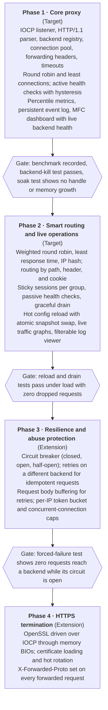

# Load Balancer / Reverse Proxy — Project Plan (C++ / MFC), Revised

Sep 27, 2026 · @SAP

> Converted from the original PDF (`docs/Load Balancer Reverse Proxy — Project Plan (C++ MFC), Revised.pdf`). Section numbers and tables are preserved; the two diagrams are reproduced as Mermaid. This file is the working reference.

---

## 0. Overview and requirements

The goal is an HTTP/1.1 load balancer and reverse proxy, built as one C++/MFC Windows application and delivered in four phases, each of which is a working system on its own. Phases 1 and 2 are the target; phases 3 and 4 are extensions.

The brief has 10 capabilities. Each has a checkable definition of done and the phase that delivers it. Section XIII re-checks every row.

| # | Requirement | Done means | Phase |
|---|---|---|---|
| 1 | Route to the least-busy, fastest, or most capable backend | Round robin, least connections, weighted round robin, and least response time are selectable per backend group, and each measurably changes traffic distribution under load | 1 (RR, least connections), 2 (weighted, least response time, IP hash) |
| 2 | Route by URL, header, or cookie | Two requests differing only in path, header, or cookie land in different backend groups | 2 |
| 3 | Sticky sessions | A client sending the same session cookie reaches the same backend within a group until that backend becomes unhealthy or starts draining | 2 |
| 4 | Health checks and failover | Backends are marked down and back up automatically, with hysteresis. Once a failure is detected, no new requests reach that backend. Requests already in flight to it fail unless they are safe to retry (IV.11) | 1 (active checks), 2 (passive checks) |
| 5 | Retries and circuit breaking | Failed idempotent requests are retried once on a different backend; a repeatedly failing backend receives zero traffic while its circuit is open | 3 |
| 6 | Graceful removal | A draining backend gets no new requests, its in-flight requests finish, and it is removed when its in-flight count reaches zero or the drain timeout expires | 2 |
| 7 | Live config changes | Backends, weights, and routing rules change while running, with no restart, no dropped requests, and no request seeing a half-applied config | 2 |
| 8 | HTTPS termination | Clients connect to the proxy over TLS; the proxy forwards plain HTTP to backends and tells them the original scheme via X-Forwarded-Proto; the proxy refuses to start or reload with an expired or mismatched certificate and key | 4 |
| 9 | Abuse protection | One source far above its limit is throttled while other sources see no change in success rate or latency | 3 |
| 10 | Honest observability | Per-backend p50/p95/p99/max latency, live health state, live traffic graphs, and a persistent event log of failures and recoveries | 1 (percentiles, health, log), 2 (graphs, log viewer) |

Fixed constraint: the implementation is C++ with MFC. Section II defines where MFC is used and where it is deliberately not used.

## I. Build phases

The project ships in four phases, and each phase ends as a working, demo-able proxy. A finished phase 2 is a complete resume project; phases 3 and 4 are added only if time allows.

*Diagram: build phases · 4 phases, 3 gates — "Phases 1 and 2 are the resume target; 3 and 4 are extensions"*

Each gate is a test from Section IX that must pass before the next phase starts. There are no dates here by design: the plan defines what "done" means, not how long it takes.

Phase 1 already includes connection pooling, forwarding headers, and timeouts. They look like details, but a proxy without them is not realistic, and interviewers ask about them.

## II. Technology stack decisions

MFC runs the application shell and GUI; raw Winsock2 with I/O completion ports runs the network data plane. These decisions are fixed so every later section can rely on them.

1. **Application shell and GUI: MFC.** One dialog-based or SDI MFC executable hosts both the proxy engine and the operator dashboard. This satisfies the MFC constraint and gives observability a natural home.
2. **Data plane: Winsock2 with IOCP, not `CSocket` or `CAsyncSocket`.** MFC's socket classes deliver events through a hidden window and the message pump, which does not scale to thousands of connections. The engine uses a fixed pool of IOCP worker threads, created at startup, with the count set in config (default: number of CPU cores). There is no thread per connection. Worker threads never touch UI objects; they post messages carrying immutable snapshots to the UI thread.
3. **TLS: OpenSSL, driven through memory BIOs.** OpenSSL normally reads and writes the socket itself, which conflicts with IOCP. Instead, encrypted bytes that IOCP receives are written into an OpenSSL memory BIO, decrypted with the SSL object, and outgoing encrypted bytes are drained from a second memory BIO and sent with IOCP. This is the hardest single piece of the project, which is why TLS is phase 4. Windows SChannel was considered: it avoids an external dependency and uses the Windows certificate store, but gives less direct control over protocol versions and cipher suites.
4. **Configuration: JSON, parsed with nlohmann/json.** Backend lists and routing rules are nested data, and hot reload needs parse-and-validate before apply, which is simpler with structured data than with INI files or the registry.
5. **Language standard and build: C++20 with MSVC in Visual Studio; dependencies (OpenSSL, nlohmann/json, GoogleTest) through vcpkg.** C++20 gives `std::atomic<std::shared_ptr>` for the config snapshot swap.
6. **Engine data structures: standard C++ containers.** MFC types such as `CString` and `CArray` appear only at the UI boundary. This keeps the engine testable without MFC.
7. **Synchronization: `SRWLOCK` reader-writer locks for shared structures, atomics for hot counters, and a copy-on-write config snapshot.** Each request captures the current snapshot pointer when it starts; a reload builds a new snapshot and swaps the pointer atomically.
8. **Time: a monotonic clock (`std::chrono::steady_clock`) for every interval and timeout,** so a wall-clock change cannot break health-check timing, rate-limit windows, or timeouts.
9. **Protocol scope: HTTP/1.1,** including keep-alive and chunked transfer encoding. HTTP/2 and WebSocket are out of scope (Section XII).

## III. Architecture and request pipeline

The system is one MFC process containing 18 components; every request passes through them in a fixed order, and routing always runs before session affinity.

*Diagram: request pipeline · 11 steps, 1 retry loop — "Affinity is checked after routing, inside the chosen group"*

```mermaid
flowchart LR
    L["Listener<br/>IOCP accept"] --> T["TLS termination<br/>HTTPS ports, phase 4"] --> H["HTTP parser<br/>path, headers, cookies"] --> R["Rate limiter<br/>over limit: 429"]
    R --> CR["Content routing<br/>chooses the group"] --> SA["Session affinity<br/>sticky in this group"] --> LB["Load balancer<br/>chooses a backend"] --> CC["Circuit check<br/>open: choose again"]
    CC --> CP["Connection pool<br/>reuse idle connection"] --> SB["Send to backend<br/>adds X-Forwarded-*"] --> RT{"Retry?"}
    RT -- "yes: another backend" --> LB
    RT -- "no" --> RC["Reply to client<br/>or 502/503 error"]
    RC --> M["Metrics and event log record every outcome, including 429s, errors, and retries"]
```

The top row runs once per request, the middle row picks a backend, and the bottom row sends and, for safe failures, loops back to choose a different backend. On a keep-alive connection, each new request starts again at the parser.

Components, with the phase that first delivers each one:

1. Connection acceptor / listener (1)
2. TLS termination module (4)
3. HTTP request/response parser (1)
4. Backend registry and state store (1)
5. Backend connection pool (1)
6. Forwarding headers and request rewriting (1)
7. Load balancing algorithm engine (1, extended in 2)
8. Content-aware routing engine (2)
9. Session affinity manager (2)
10. Health check subsystem (1 active, 2 passive)
11. Circuit breaker and retry manager (3)
12. Graceful drain manager (2)
13. Rate limiter / abuse protection (3)
14. Configuration manager with hot reload (2)
15. Metrics and statistics engine (1)
16. Event log / audit trail (1)
17. MFC dashboard and admin console (1, extended in 2)
18. Request pipeline orchestrator (1)

The order is fixed: rate limit, then content routing picks a group, then affinity looks for a sticky backend inside that group, then the load balancer picks a backend if there is no valid sticky one, then the circuit check, then the connection pool and send, then retry on safe failure, and metrics and logging for every outcome.

## IV. Component plans

Each component below lists its purpose, what it owns, what it must handle, and a definition of done that can be checked by a test.

### IV.1 Connection acceptor / listener (phase 1)

**Purpose:** accept TCP connections on the configured HTTP and HTTPS ports using `AcceptEx` on the IOCP handle.

**Owns:** listening sockets, the IOCP handle, the worker thread pool.

**Must handle:** plaintext and TLS ports; a global connection limit, where connections over the limit are refused and logged, never silently dropped; clean shutdown that stops accepting and hands off to the drain manager.

**Done:** a deliberately slow client does not raise other clients' p99 latency, and after shutdown the process holds no open sockets (checked by handle count).

### IV.2 TLS termination module (phase 4)

**Purpose:** requirement 8. Completes the TLS handshake with the client, decrypts inbound data, and encrypts outbound data. The hop to backends is always plain HTTP.

**Owns:** the certificate and private key, the OpenSSL context, and per connection an SSL object with two memory BIOs (Section II.3).

**Who validates what:** the client validates the proxy's certificate; the proxy does not request or validate client certificates (mutual TLS is out of scope). The proxy's own job is to serve only a certificate that is valid and matches its key.

**Must handle:**

- At startup and on every reload, refuse a certificate that is expired, not yet valid, or does not match the private key. On reload, keep serving the previous certificate and log the reason.
- Minimum protocol version TLS 1.2.
- Failed client handshakes (unsupported version, malformed hello) close only that connection and are logged.
- Certificate rotation through the config manager: new connections use the new certificate, existing ones finish on the old one.
- Downstream components see only plain HTTP bytes plus a flag recording that the connection was TLS, used for `X-Forwarded-Proto`.

**Done:** curl and a browser complete HTTPS requests; a packet capture of the backend hop shows plain HTTP; `openssl s_client` shows TLS 1.2 or 1.3 and the configured certificate; a reload with an expired certificate is rejected and logged while the old one keeps serving.

### IV.3 HTTP request/response parser (phase 1)

**Purpose:** turn raw bytes into structured requests and responses in both directions, including keep-alive and chunked encoding.

**Owns:** nothing persistent; it is pure transformation logic.

**Must handle:**

- Messages split across many TCP reads.
- Malformed input answered with 400, never a crash.
- Limits on request-line length, total header size, and header count (431 or 400 when exceeded).
- Strict framing: reject any request that has both `Content-Length` and `Transfer-Encoding`, or conflicting `Content-Length` values (request smuggling defense, Section VII).
- Response framing (`Content-Length`, chunked, or close-delimited), so the proxy knows exactly where a backend response ends and whether the connection can go back to the pool.

**Done:** unit tests cover split reads and every framing case; a corpus of malformed and smuggling-style inputs produces 400s with zero crashes.

### IV.4 Backend registry and state store (phase 1)

**Purpose:** the single source of truth for which backends exist and their state: healthy, unhealthy, draining, or circuit-open (phase 3).

**Owns:** the backend list (id, address, weight, group), per-backend live counters (in-flight requests, latency samples, success and failure counts), and per-backend state.

**Must handle:** many concurrent readers and occasional writers (health checks, drain, config reload). Structure changes are guarded by an `SRWLOCK`; hot counters are atomics.

**Done:** no request is ever sent to a backend that is not healthy and non-draining at selection time, checked by a debug-build assertion and by the kill and drain tests.

### IV.5 Backend connection pool (phase 1, new)

**Purpose:** reuse keep-alive TCP connections to backends instead of opening a new connection per request.

**Owns:** per backend, a list of idle connections with a maximum idle count, an idle timeout, and a maximum total connection count.

**Must handle:**

- A connection returns to the pool only after its response has been fully read with clean framing.
- Connections the backend has closed are detected on reuse and discarded.
- When a backend reaches its connection cap, new requests wait in a bounded queue, then fail with 503.
- A backend that goes unhealthy or starts draining has its idle connections closed immediately.

**Decision:** "least connections" counts in-flight requests per backend, not open pooled sockets.

**Done:** under steady load, new backend connections per second is far below requests per second (both shown on the dashboard), and a killed backend does not leave stale pooled connections that cause repeated errors.

### IV.6 Forwarding headers and request rewriting (phase 1, new)

**Purpose:** let backends see the original client and scheme, since they only ever see the proxy's address.

**Must handle:**

- Append the client IP to `X-Forwarded-For` (append, never replace).
- Set `X-Forwarded-Proto` to `http` or `https`.
- Preserve the original `Host` header by default, configurable per group, and set `X-Forwarded-Host`.
- Remove hop-by-hop headers (`Connection`, `Keep-Alive`, `Proxy-Connection`, `TE`, `Trailer`, `Upgrade`) and re-frame the body for the backend hop.
- Add an `X-Request-Id` so one request can be traced through the event log.

**Trust rule:** an `X-Forwarded-For` sent by a client is untrusted. The rate limiter uses the TCP peer address unless the peer is on a configured list of trusted upstream proxies.

**Done:** an echo backend shows the correct `X-Forwarded-For`, `X-Forwarded-Proto`, and `Host`; a client that spoofs `X-Forwarded-For` does not change its rate-limit identity.

### IV.7 Load balancing algorithm engine (phase 1, extended in phase 2)

**Purpose:** requirement 1. Picks the specific backend within a group when there is no valid sticky backend.

**Strategies, selectable per group:** round robin and least connections (phase 1); weighted round robin for capacity, least response time using an exponentially weighted moving average of latency, and source-IP hash (phase 2).

**Must handle:** choosing only among backends that are healthy, not draining, and not circuit-open; breaking ties by rotation so the first backend is not always chosen; returning 503 with a loud log entry when no backend is eligible.

**Done:** under synthetic load, an artificially slow backend receives measurably less traffic under least response time, and backends weighted 3:1 receive close to a 3:1 share under weighted round robin.

### IV.8 Content-aware routing engine (phase 2)

**Purpose:** requirement 2. Decides which backend group a request goes to.

**Rule types:** path prefix or pattern, header presence or value, cookie presence or value, evaluated in a defined priority order, with a default group when nothing matches.

**Fixed ordering:** routing runs for every request, including clients that have a sticky session. Affinity is checked afterward, inside the chosen group.

**Done:** two requests that differ only in path, header, or cookie land in different groups; a client stuck to a backend in group A that requests a path belonging to group B reaches group B.

### IV.9 Session affinity manager (phase 2)

**Purpose:** the sticky-session part of requirement 3.

**Owns:** a map from (group, session key) to backend id, with a TTL. The session key is either an existing application cookie (name configured per group) or a cookie the proxy inserts.

**Must handle:** looking up stickiness only within the group routing already chose; when the sticky backend is unhealthy, draining, or circuit-open, asking the load balancer for a new backend in the same group, updating the map, and logging the reassignment.

**Considered alternative:** a proxy-inserted cookie could carry an opaque backend id directly, needing no table and surviving restarts. The table is kept because it also works with existing application cookies.

**Limitation:** the map is in memory, so a proxy restart reassigns sticky clients. Persistence is out of scope (Section XII).

**Done:** a client sending the same cookie reaches the same backend across repeated requests; after that backend is killed, the next request goes to a new backend in the same group and later requests stay there.

### IV.10 Health check subsystem (phase 1 active, phase 2 passive)

**Purpose:** requirement 4.

**Active checks (phase 1):** periodic TCP-connect or HTTP GET probes to each backend's health endpoint, each with its own timeout, run on a dedicated timer-driven thread so a slow probe never blocks live traffic.

**Passive checks (phase 2):** real request outcomes (connection refused, timeout, and optionally 5xx) also count toward health.

**Hysteresis:** a backend goes down after N consecutive failures and comes back after M consecutive successes, so a single blip does not flap it in and out of rotation.

**Relation to the circuit breaker:** health checks answer "is it reachable at all"; the circuit breaker answers "is it failing under real load even though reachable".

**Done:**

- A killed backend is excluded within the detection window (probe interval × N, plus the probe timeout).
- Requests that arrive after exclusion see zero errors.
- Requests already in flight to the backend when it died fail, unless they are idempotent and phase 3 retries are enabled, in which case they succeed on another backend.
- A restarted backend is re-included after M successful probes.
- A single failed probe does not remove a backend.

### IV.11 Circuit breaker and retry manager (phase 3)

**Purpose:** requirement 5.

**Retry rules:**

- Retry only on a different backend, never the one that just failed.
- Retry automatically only GET, HEAD, and OPTIONS. Other methods are retried only when a route explicitly opts in.
- Retry only if no response bytes have reached the client yet.
- At most one retry per request by default, and a retry budget that caps retries at a configured share of total requests (for example 10%), so a failing backend cannot multiply load into a retry storm.

**Request body buffering (new):** a retry needs the original request body. Bodies up to a configured size (for example 64 KB) are buffered in memory and can be retried; larger bodies are streamed straight through and marked not retryable.

**Circuit breaker states:**

- **Closed:** traffic flows; failures are counted in a sliding window, with a minimum request count so two failures out of three requests do not trip it.
- **Open:** once the failure rate crosses the threshold, the backend gets zero traffic for a cooldown period.
- **Half-open:** after cooldown, a limited number of trial requests go through; success closes the circuit, failure re-opens it.

**Done:** during a forced-failure test, the per-backend request counter shows zero requests while the circuit is open and only the configured trial count in half-open; an idempotent request whose first backend fails succeeds on the second.

### IV.12 Graceful drain manager (phase 2)

**Purpose:** requirement 6.

Draining is its own state, separate from unhealthy: a draining backend gets no new requests and no new sticky assignments, but its in-flight requests finish normally.

**Must handle:**

- A per-backend in-flight counter, so removal happens when it reaches zero.
- Closing the backend's idle pooled connections as soon as drain starts.
- A drain timeout. When it expires, the remaining requests are aborted, clients receive 502 (or the request is retried if it qualifies under IV.11), the backend is removed, and the event is logged.
- Precedence: a config reload never silently un-drains a backend unless the new config explicitly says so.

**Done:** draining a backend under active load results in zero new requests to it, zero interrupted in-flight requests, and removal once its counter reaches zero or the timeout fires.

### IV.13 Rate limiter / abuse protection (phase 3)

**Purpose:** requirement 9.

**Identity:** the TCP peer address by default (or `X-Forwarded-For` only from trusted proxies, IV.6); optionally an authenticated user id from a configured header or cookie.

**Must handle:**

- A token bucket per identity with configurable rate and burst. Requests over the limit get 429 with `Retry-After`, before any routing work is done.
- A cap on concurrent connections per source IP, enforced at the listener, against connection floods.
- A sharded table (one lock per shard) so abuse traffic does not create one global bottleneck.
- Periodic cleanup of idle entries so memory stays bounded.

**Done:** one source sending far above its limit receives 429s, while other sources show no change in success rate and no measurable change in p99 latency.

### IV.14 Configuration manager with hot reload (phase 2)

**Purpose:** requirement 7.

**Can change without restart:** backends (add, remove), weights, routing rules, rate limits, health-check settings, pool settings, TLS certificate paths.

**Must handle:**

- Parse and fully validate a new config before applying anything. An invalid config is rejected and logged, and the system keeps running on the last good one.
- Apply by building a new immutable snapshot and swapping the pointer atomically, so in-flight requests keep their old snapshot and new requests see the complete new one.
- Triggers: file changes detected with `ReadDirectoryChangesW`, debounced because editors often save in several writes, and edits made in the GUI.
- GUI edits go through the same validation, then are written to the config file. The file watcher ignores a change whose content hash matches the active config, so a GUI save does not trigger a second reload.

**Done:** adding or removing a backend or changing a rule under load takes effect for new requests with zero dropped connections; a deliberately broken config is rejected, logged, and has no effect.

### IV.15 Metrics and statistics engine (phase 1)

**Purpose:** the statistics half of requirement 10. Averages alone are not acceptable.

**Must maintain, per backend and system-wide:**

- A log-bucketed latency histogram (HdrHistogram-style: fixed memory, bounded relative error) giving p50, p95, p99, and max, both for a rolling live window and since start.
- Two latency measures: total time at the proxy and backend time alone, so proxy overhead is visible.
- Request rate, error rate by status class, active connections, pool reuse ratio, and retry count.

**Done:** one deliberately slow backend visibly moves p99 and max while barely moving the average, and the proxy's reported percentiles agree with the load generator's own measurements within a stated tolerance.

### IV.16 Event log / audit trail (phase 1)

**Purpose:** the event-log half of requirement 10.

**Records, at minimum:** backend marked unhealthy or healthy and why (which check, how many failures); circuit opened, half-opened, closed; drain started and completed; config reload accepted or rejected, with the reason; rate-limit blocks; retries and their outcomes; certificate load failures; sticky reassignments. Each entry carries the `X-Request-Id` when a request is involved.

**Must handle:** structured entries (one JSON object per line), written by a background thread so logging never blocks IOCP workers, persisted to disk with size-based rotation.

**Done:** after a backend-kill test, the log alone gives a clear chronological account of detection, exclusion, recovery, and re-inclusion.

### IV.17 MFC dashboard and admin console (phase 1, extended in phase 2)

**Purpose:** the visible half of requirement 10, and the operator interface for requirements 6 and 7.

**Phase 1:** a backend list control with state, in-flight requests, and weight; percentile figures with the tail (p99, max) shown prominently; a live event list.

**Phase 2:** per-backend traffic and latency graphs drawn with GDI into a double-buffered custom control; a searchable, filterable log view; admin controls to add, remove, and edit backends, edit routing rules, start a drain, and view or reset a circuit. Every admin action goes through the config manager's validation path.

**Threading rule:** only the UI thread touches UI objects. Engine threads post messages carrying copied snapshots; a UI timer refreshes the display. The UI never reads engine state directly.

**Done:** during a load test, an operator watches health, graphs, percentiles, and the log update live, and adds or removes a backend from the GUI without restarting.

### IV.18 Request pipeline orchestrator (phase 1)

**Purpose:** runs every request through the components in the order from Section III.

**Design:** each request is a small state machine advanced by IOCP completions. No worker thread ever blocks on a network call; each step resumes when its I/O completes.

**Done:** for any single request, the event log (filtered by `X-Request-Id` in debug logging mode) shows every step in the fixed order, including on error paths.

## V. Concurrency and data ownership

All network I/O runs on one fixed IOCP worker pool; there is no thread per connection anywhere in the design. A handful of dedicated threads handle background work.

**Threads:**

- **IOCP worker pool:** all client and backend socket I/O and all request processing. Size set in config, default equal to CPU cores. Workers never block on network calls.
- **Health-check thread:** timer-driven probes, isolated from live traffic.
- **Config watcher thread:** waits on `ReadDirectoryChangesW` and hands validated snapshots to the config manager.
- **Maintenance thread:** removes stale rate-limiter entries and expired sticky mappings, closes pooled connections past their idle timeout.
- **Log writer thread:** drains the event queue to disk and rotates files.
- **UI thread:** MFC's main thread; rendering and dispatching admin actions only, no networking.

**Shared state and its protection:**

| State | Protection | Reason |
|---|---|---|
| Config snapshot | `std::atomic<std::shared_ptr>` swap | Read by every request; readers never lock |
| Backend registry structure | `SRWLOCK` (reader-writer) | Many readers per request, rare writers |
| Per-backend counters | Atomics | Touched on every request |
| Connection pool | One lock per backend | Contention stays local to one backend |
| Rate-limiter table | Sharded locks | Hit hardest exactly during abuse |
| Sticky-session table | Sharded locks | Same access pattern as the rate limiter |
| Metrics histograms | Per-thread histograms merged on read | Recording never contends on a lock |
| Event log | Lock-protected queue to the writer thread | Logging never blocks request handling |

The per-thread histogram design is a change from a single lock-protected histogram: each worker records into its own copy, and the UI refresh merges them, so metrics can never become the bottleneck.

## VI. Failure modes and edge cases

Every failure below has a defined behavior, and none of them is allowed to crash the process or hang a worker thread.

**Timeouts (new).** Every wait has a limit, set in config, measured on the monotonic clock:

| Timeout | Applies to | On expiry |
|---|---|---|
| Client header read | Client sending request headers | Close connection (slowloris defense) |
| Client body read | Client sending the request body | 408, close connection |
| Client keep-alive idle | Idle client connection between requests | Close connection |
| Backend connect | Opening a new backend connection | Counts as a failure; retry if eligible, else 502 |
| Backend response | Waiting for the backend's response headers | Counts as a failure; retry if eligible, else 504 |
| Pooled connection idle | Idle backend connection in the pool | Close and discard |
| Drain | Backend in draining state | Abort remaining requests, remove backend (IV.12) |

**Scenarios:**

| Scenario | Required behavior |
|---|---|
| All backends in a group unavailable | Return 503 immediately, never hang; log loudly. This is the one case where clients correctly see an error |
| Backend dies with requests in flight | Those requests fail with 502, or succeed on another backend if idempotent and retries are enabled (phase 3). Later requests are unaffected once the backend is excluded |
| Backend closes connection after sending part of a response | No retry is possible; close the client connection so the client sees an incomplete response rather than a corrupted one; log it |
| Stale pooled connection (backend closed it while idle) | Detected on reuse; discard and use a fresh connection for idempotent requests, otherwise 502 |
| Request body larger than the retry buffer | Streamed through and marked not retryable (IV.11) |
| Config reload during a drain | Drain state wins unless the new config explicitly un-drains the backend |
| Backend flapping near the health threshold | Hysteresis prevents flapping (IV.10); covered by a dedicated test |
| TLS handshake failure or garbage on an HTTPS port | Close that connection only, log it; the worker thread continues |
| Malformed, oversized, or smuggling-style HTTP | Reject with 400 or 431 at the parser (IV.3, VII) |
| Retry storm | Bounded by one retry per request, the retry budget, and the circuit breaker (IV.11) |
| Operator saves a half-written config file | Debounced watcher, then validation rejects it; the last good config stays active |
| Shutdown with requests in flight | Stop accepting, drain all backends, flush logs and metrics, then exit |
| System clock change | No effect; all intervals use the monotonic clock |

## VII. Security requirements beyond rate limiting

The proxy treats every byte from clients as untrusted, serves only a valid certificate, and assumes a local, single-operator admin console.

- **Certificate handling:** the proxy never serves an expired, not-yet-valid, or mismatched certificate, and a reload with a bad certificate is rejected (IV.2). Clients validate the proxy's certificate; the proxy does not validate client certificates because mutual TLS is not in scope.
- **TLS configuration:** minimum TLS 1.2 and a modern cipher list; weak protocols are never enabled, including for testing convenience.
- **Request smuggling (new):** because this proxy writes its own parser, it must reject ambiguous framing: requests with both `Content-Length` and `Transfer-Encoding`, duplicate or conflicting `Content-Length` values, and malformed chunk sizes. Requests are always re-framed cleanly before being sent to a backend, so the proxy and backend can never disagree about where a request ends.
- **Forwarding header trust (new):** client-supplied `X-Forwarded-*` headers are appended to, never trusted, unless the TCP peer is a configured trusted proxy (IV.6).
- **Input limits:** request line, headers, header count, and buffered body sizes are all capped and validated.
- **Admin access:** the brief does not ask for remote administration, so the GUI and the config file are protected only by access to the host machine. If remote administration were added, it would need its own authentication, transport security, and authorization, which is a large, separate piece of scope (Section XII).

## VIII. Shortcuts ruled out

These shortcuts would make the project easier and worse, so the design excludes them.

- Using MFC's message-pump socket classes for the data path.
- A thread per connection, or blocking network calls on IOCP worker threads.
- Opening a new backend connection for every request instead of pooling.
- Reporting only average latency as monitoring.
- One global lock around all shared state.
- Automatically retrying non-idempotent requests without an explicit per-route opt-in.
- Serving an invalid or mismatched certificate, or enabling weak TLS versions.
- Trusting client-supplied `X-Forwarded-For` for rate limiting.
- Lenient parsing of ambiguous request framing.
- Applying a config before it is fully validated.
- Treating unhealthy and draining as one state. An unhealthy backend keeps receiving health probes so its recovery is detected; a draining backend is being removed on purpose, and its in-flight requests are allowed to finish.
- Checking session affinity before content routing.
- A rate-limiter table that grows forever with no cleanup.

## IX. Testing and validation

Every definition of done in Section IV maps to one of the test levels below, and each level has named tools.

| Level | What it proves | Tools |
|---|---|---|
| Unit | Algorithm selection, circuit state transitions, token-bucket accounting, config validation (accepts good, rejects each class of bad), routing rule matching, parser framing cases | GoogleTest |
| Integration | Full request lifecycle: routing, sticky sessions, failover on backend kill, circuit trip and recovery, drain under load, forwarding headers | Mock backends (below), scripted scenarios |
| Load | Algorithms shift traffic by real load and speed; proxy percentiles match the load generator's | k6 with the constant-arrival-rate executor |
| Chaos | Backend kill, forced slow or failing responses, live config corruption, drain mid-load | Mock backend fault switches, scripted process kills |
| Security and abuse | Single-IP flood is throttled while others are unaffected; smuggling and malformed input rejected; TLS settings correct | k6 per-source scenarios, a malformed-request corpus, `openssl s_client` |
| Fuzzing | The parser never crashes on arbitrary bytes | Experimental MSVC libFuzzer (`/fsanitize=fuzzer`) plus AddressSanitizer (`/fsanitize=address`) |
| Soak | No handle or memory growth under long continuous load | Performance Monitor (handle count, private bytes), CRT debug heap, Application Verifier |
| Shutdown | Shutdown drains everything and exits with no orphaned threads, sockets, or log corruption | Handle count before and after, log inspection |

**Mock backends:** a small configurable HTTP server, run as several instances, with switches for added latency, error rate, abrupt connection close, partial responses, and a mode that echoes received headers back. It is the most reused test tool in the project, so it is built in phase 1.

**Measurement caveat:** a closed-loop load generator (each virtual user waits for its response before sending the next) under-reports tail latency, an effect called coordinated omission. k6's arrival-rate executors use an open model that starts requests independently of response time, which is why the load tests use constant-arrival-rate (k6 docs).

**Fuzzing note:** MSVC's `/fsanitize=fuzzer` is marked experimental and needs Visual Studio 2022 version 17.0 or later; Microsoft recommends pairing it with `/fsanitize=address`, and the two flags must be passed separately (Microsoft docs). If it proves unreliable, run the parser fuzz target under clang-cl instead.

**Backend hop check:** a Wireshark capture confirms that the proxy-to-backend hop is plain HTTP in phase 4.

## X. Benchmarking and resume metrics (new)

The project's resume value comes from measured numbers, so every phase gate records the benchmarks below. The bracketed values are placeholders to fill with real results, never estimates.

| Metric | How it is measured |
|---|---|
| Throughput | Highest steady request rate the proxy sustains while p99 stays under a chosen target, with k6 constant-arrival-rate |
| Proxy overhead | Proxy p50 and p99 minus the same test sent directly to one backend |
| Tail latency | p50, p95, p99, max from both the proxy's metrics and k6, compared |
| Failover time | Time from killing a backend to its exclusion, read from the event log |
| Errors during failover | Failed requests during a backend kill, with and without phase 3 retries |
| Drain and reload safety | Dropped requests during a drain and during a config reload under load (target: zero) |
| Connection reuse | Pool reuse ratio: requests per new backend connection |
| Stability | Handle count and private bytes at the start and end of a long soak run |

**Method:** record the hardware and OS, and whether the load generator, proxy, and backends share a machine (they compete for CPU if they do). Warm up before measuring, run each test at least three times, and report the median run.

**Resume bullet templates:**

- Built an HTTP/1.1 reverse proxy and load balancer in C++ on Windows IOCP, sustaining [X] req/s at [Y] ms p99 across [N] backends with [Z] ms median proxy overhead.
- Implemented health checks with hysteresis and connection pooling; a killed backend is excluded in [T] s with zero errors for requests arriving after detection.
- Added hot config reload via atomic snapshot swap and graceful drain, with zero dropped requests under [X] req/s load.
- Built an MFC operations dashboard showing live p50/p95/p99/max latency from log-bucketed histograms, verified against k6 within [E]%.

**Decisions to be able to explain without notes:** why IOCP instead of MFC sockets; why affinity runs after routing; why only idempotent requests are retried and why bodies must be buffered; why averages hide tail latency and what coordinated omission is; how the snapshot swap keeps in-flight requests consistent; what request smuggling is and how the parser prevents it.

## XI. Documentation deliverables

Five documents ship with the code; the README is the one recruiters and interviewers will actually open.

- **README (new):** what the project is, the pipeline diagram, how to build and run it, the benchmark table from Section X with hardware details, and a short screen recording of the dashboard during a backend-kill test.
- **Architecture document:** the component map and request pipeline, based on this plan.
- **Configuration reference:** every field (backends, groups, routing rules, health checks, pool, timeouts, circuit breaker, rate limits, TLS paths, sticky sessions, trusted proxies), what it controls, and its valid range.
- **Operator guide:** what each dashboard panel and graph shows, and how to add or remove a backend, edit a rule, and start a drain.
- **Runbook:** what each event-log entry means and what an operator should check, for example what "circuit opened" on a backend implies.

## XII. Out of scope

These are not required by the brief, so they are named here instead of silently included or silently dropped.

- HTTP/2 and WebSocket passthrough (the brief describes HTTP request, header, and cookie routing only).
- Mutual TLS, where the proxy validates client certificates.
- TLS on the proxy-to-backend hop (the brief specifies plain HTTP internally).
- Persisting sticky sessions or metrics history across a proxy restart.
- High availability of the proxy itself (clustering or failover between proxy instances).
- Remote or networked administration and its authentication (Section VII assumes a local console).

## XIII. Coverage check

All 10 requirements and all 12 review findings map to a specific section with a testable definition of done.

**Requirements:**

| # | Requirement | Where | Phase |
|---|---|---|---|
| 1 | Smart backend selection | IV.7 | 1, 2 |
| 2 | Content-based routing | IV.8 | 2 |
| 3 | Sticky sessions | IV.9 | 2 |
| 4 | Health checks and failover | IV.10 | 1, 2 |
| 5 | Retries and circuit breaking | IV.11 | 3 |
| 6 | Graceful removal | IV.12 | 2 |
| 7 | Live config changes | IV.14 | 2 |
| 8 | HTTPS termination | II.3, IV.2 | 4 |
| 9 | Abuse protection | IV.13 | 3 |
| 10 | Honest observability | IV.15, IV.16, IV.17 | 1, 2 |

The MFC constraint is covered in II.1 and II.2: MFC owns the shell, GUI, and admin surface; Winsock2 with IOCP owns the data plane.

**Review findings:**

| Finding | Where it is fixed |
|---|---|
| TLS certificate validation described backwards | IV.2, VII, IX |
| "Zero client-visible errors" on backend kill overpromised | 0 (row 4), IV.10, VI |
| Affinity checked before routing | III, IV.8, IV.9, VIII |
| Thread-per-connection contradiction | II.2, V |
| Wrong cross-reference to Section VIII | XII now referenced correctly from II.9, IV.9, VII |
| No backend connection pooling | IV.5 |
| No forwarding headers | IV.6, VII |
| No backend timeouts | VI (timeouts table) |
| No request body buffering for retries | IV.11, VI |
| No request smuggling defense | IV.3, VII |
| OpenSSL with IOCP treated as simple | II.3, I (moved to phase 4) |
| No test tooling | IX |

## XIV. Change log

Compared with the original plan: 5 errors fixed, 7 missing pieces added, a phased structure and benchmarking added, and nothing from the original 10 requirements dropped.

**Changed**

| Item | Before | After |
|---|---|---|
| TLS certificate handling | Proxy "rejects handshakes with invalid/expired certs" | Proxy refuses to serve or reload a bad certificate; clients validate the proxy; mutual TLS out of scope (IV.2) |
| Failover definition of done | "Zero client-visible errors" when a backend is killed | Zero errors after detection; in-flight requests fail unless safely retried (IV.10) |
| Session affinity order | Sticky users skip routing | Routing always runs first; affinity is per group (III, IV.8, IV.9) |
| Threading model | "Per-connection worker threads / IOCP pool" | IOCP pool only, no thread per connection (II.2, V) |
| Cross-reference | Out-of-scope section pointed to "Section VIII" for security | Points to the correct section (XII, VII) |
| Requirements table | Requirement and done only | Adds the phase delivering each requirement (0) |
| JSON library | "e.g. a JSON parsing library" | nlohmann/json, named (II.4) |
| Retry rules | Different backend, idempotent only, max count | Also: only before response bytes reach the client, plus a retry budget (IV.11) |
| Circuit breaker | Failure-rate threshold | Adds a minimum request count before it can trip (IV.11) |
| Graceful drain | In-flight counter and timeout | Also closes idle pooled connections; timeout outcome defined as 502 or retry (IV.12) |
| Rate limiter identity | Source IP | TCP peer address, or X-Forwarded-For only from trusted proxies (IV.13) |
| Config manager | File watcher and GUI | Adds debouncing and a content-hash check so a GUI save does not reload twice (IV.14) |
| Metrics | "Histogram or equivalent" with one lock | Log-bucketed, per-thread histograms; proxy time and backend time measured separately (IV.15, V) |
| Event log | Persisted with rotation | JSON lines, background writer thread, request ids (IV.16) |
| Dashboard | One feature list | Split into phase 1 and phase 2; double-buffered GDI graphs (IV.17) |
| Orchestrator | Sequence only | Per-request state machine driven by IOCP completions (IV.18) |
| Failure modes | Prose list | Two tables: timeouts, and scenarios with required behavior (VI) |
| Testing | Pass/fail criteria only | Criteria plus named tools per level (IX) |
| Writing style | Meta-commentary throughout | Direct statements of decisions |

**Removed**

| Item | Why |
|---|---|
| Test "handshake with an invalid/expired certificate to confirm rejection" | It tests the client, not the proxy; replaced by the reload-rejection test (IV.2) |
| Anti-pattern "disabling TLS certificate validation" | Based on the same misunderstanding; replaced by "serving an invalid certificate or enabling weak TLS" (VIII) |
| "Encrypted end-to-end to the proxy" | Contradictory: termination is not end-to-end |
| Phrases such as "stated plainly rather than hidden" and "on the record" | They describe the writing instead of the system, and read as machine-generated |
| Closing status recap ("no code, no timelines" notes) | Replaced by the coverage check (XIII); the plan still contains no code and no dates |

**Added**

| Item | Where |
|---|---|
| Four build phases with test gates, and a roadmap drawing | I |
| Request pipeline drawing | III |
| Backend connection pool component | IV.5 |
| Forwarding headers and request rewriting component, with a trust rule | IV.6 |
| OpenSSL over IOCP through memory BIOs, and why TLS is phase 4 | II.3 |
| C++20, MSVC, vcpkg; monotonic clock decision | II.5, II.8 |
| Request smuggling defense and strict framing | IV.3, VII |
| Request body buffering for retries | IV.11 |
| Timeouts table (client, backend, pool, drain) | VI |
| Scenarios: partial backend response, stale pooled connection, oversized body | VI |
| Config watcher and log writer threads; shared-state table | V |
| Sticky-cookie alternative considered | IV.9 |
| Test tools, mock backends, coordinated-omission caveat, fuzzing | IX |
| Benchmark metrics, method, resume bullet templates, decisions to explain | X |
| README deliverable | XI |
| Out of scope: mutual TLS, TLS to backends | XII |
